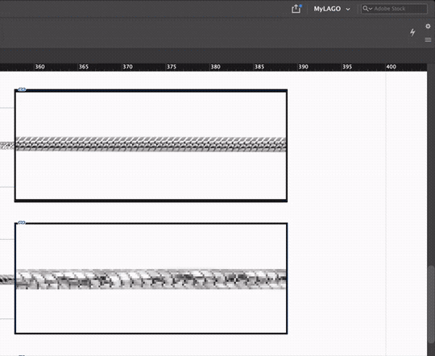
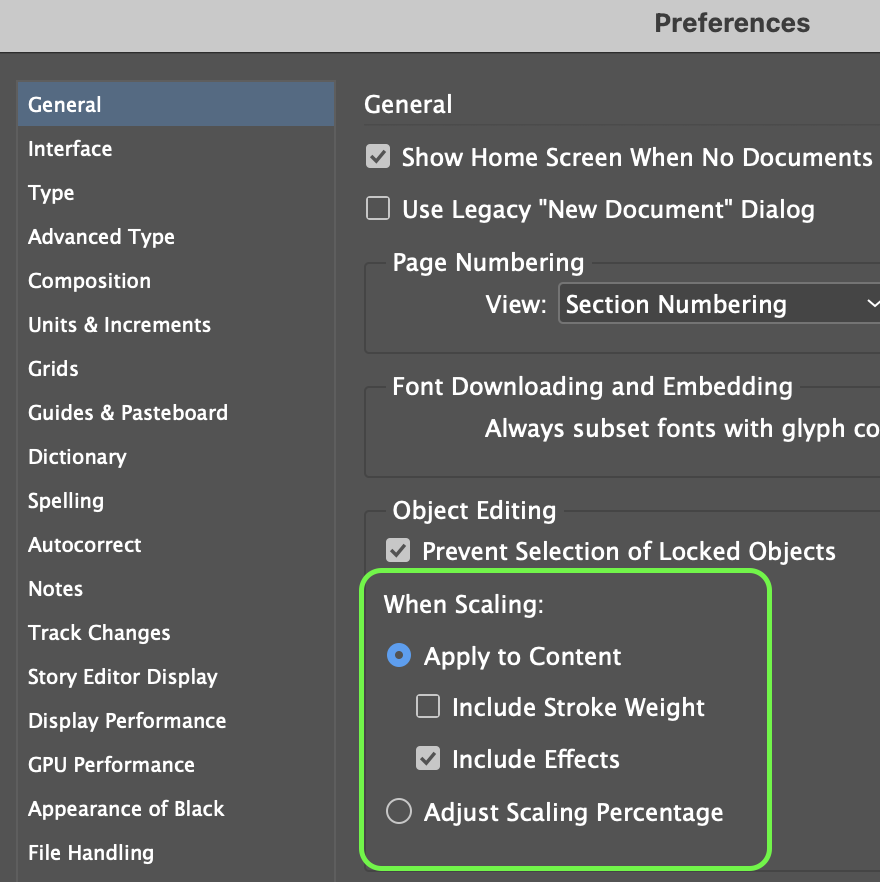

---
hide:
  - tags
  - footer
tags:
  - Scripting
  - Script
---

# **Stroke Scaling Incorrectly**

{==

When scaling objects that contain a stroke, if the stroke scales disproportionately, you can reset the stroke’s scaling.

==}

## **Select Object**

1. Click on the stacked ***hamburger*** menu in the upper-right of InDesign window.
2. Click ***Redefine Scaling as 100%***

<!-- Image Centered -->
<figure markdown="span">
  { width="600" }
</figure>

!!! DIVIDER ""

## **Set Preferences**
*To prevent this from happening again*

**InDesign > Preferences > General**

!!! note "Setting preferences with no document open makes it the default behavior for all new documents"

- When ***Apply To Content*** is selected, scaling values are reset to 100%
in the Transform panel after the object is scaled.
- Or in the flyout menu of the **Transform panel**, simply check or uncheck ***Adjust Stroke Weight when Scaling*** to adjust the behavior accordingly.

{ width="340", align=right }

Reference: [How to turn on or off InDesign stroke scaling](https://www.thegraphicmac.com/how-to-turn-on-or-off-indesign-stroke-scaling/)

---
